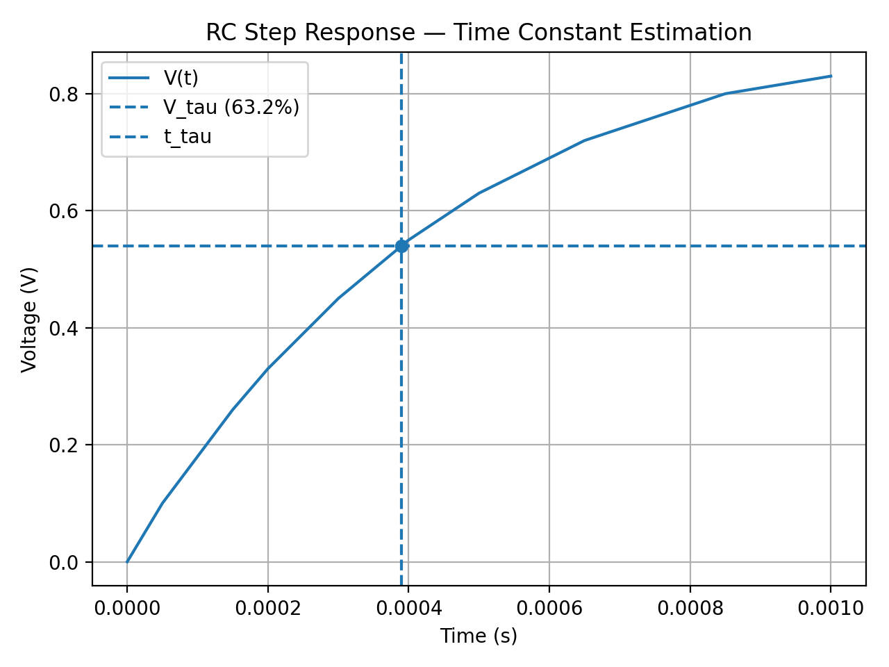
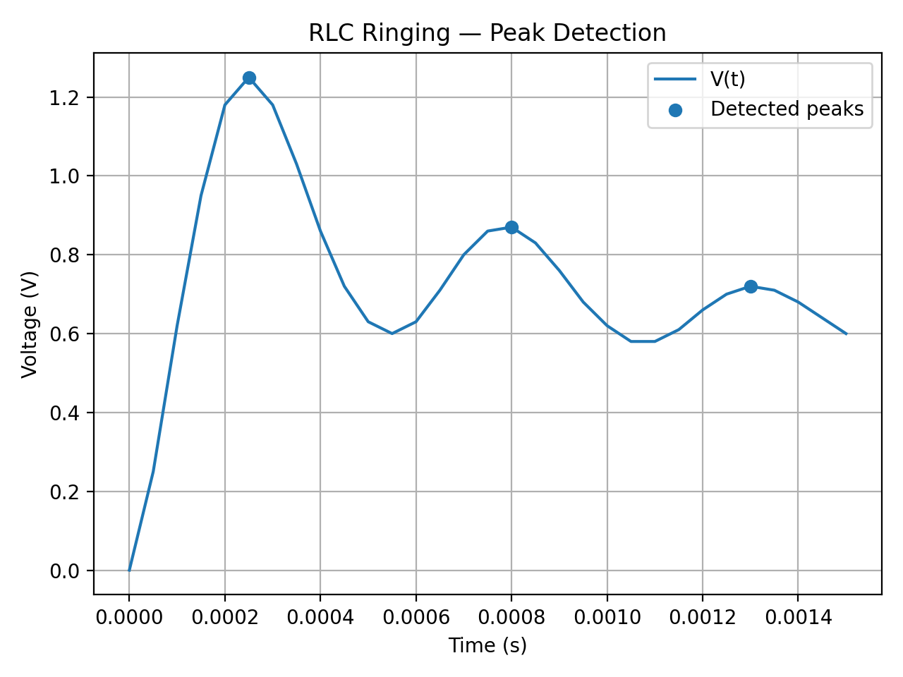

# Transient Trace Analyzer (RC/RLC)

A Python tool that analyzes oscilloscope-style time/voltage traces to estimate transient parameters and generate a plot + report.

✅ Current MVP: **RC step response → time constant τ (63.2% method)**  
🚧 Next: **RLC underdamped response → α, ωd, ω0, ζ**

---

## What it does (RC MVP)
Given a CSV trace containing `(time, voltage)`:
- estimates **V0**, **V∞**
- computes **Vτ = V0 + 0.632(V∞ − V0)**
- finds **tτ** and calculates **τ**
- saves:
  - `plot.png` (trace with τ markers)
  - `report.md` (summary report)

---

## Quickstart
    ### RC example
```powershell
$env:PYTHONPATH="src"
python -m transient_analyzer.cli examples/synthetic_rc.csv --mode rc --out out_rc

## Output files
- RC outputs (example): `out_rc/plot.png`, `out_rc/report.md`, `out_rc/metrics.json`
- RLC outputs (example): `out_rlc/plot.png`, `out_rlc/report.md`, `out_rlc/metrics.json`


### 1) Install dependencies
```bash
pip install -r requirements.txt

## Example plots

### RC (τ)


### RLC (peaks)


